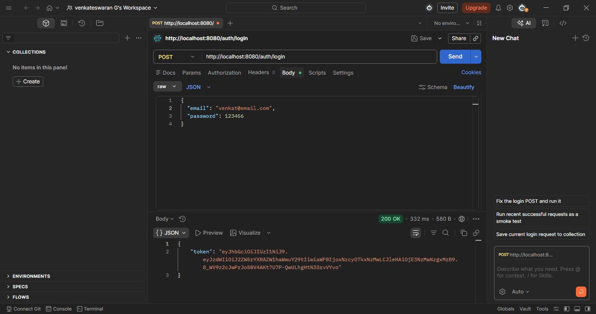
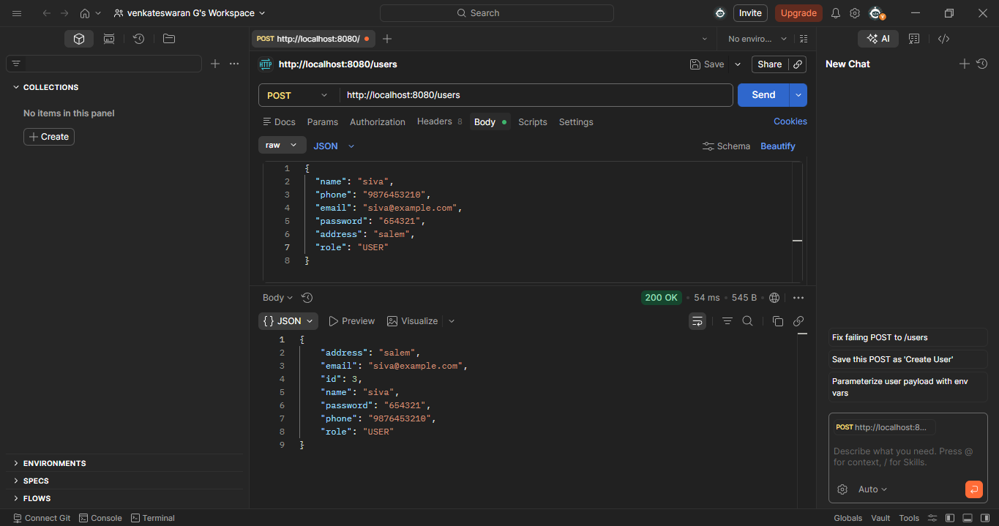
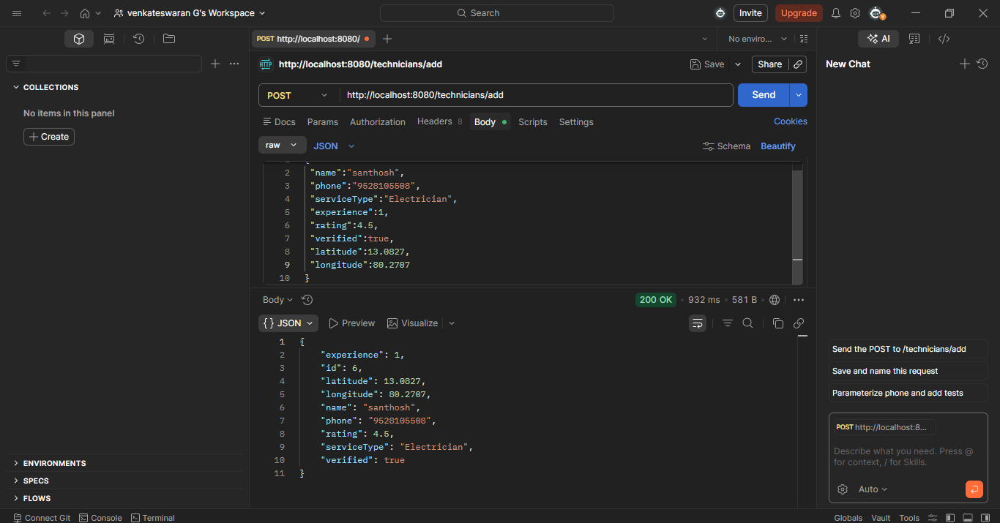
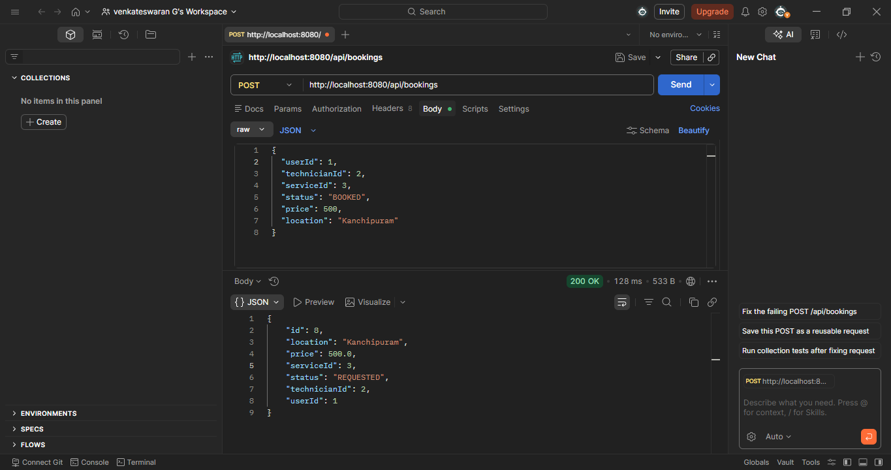
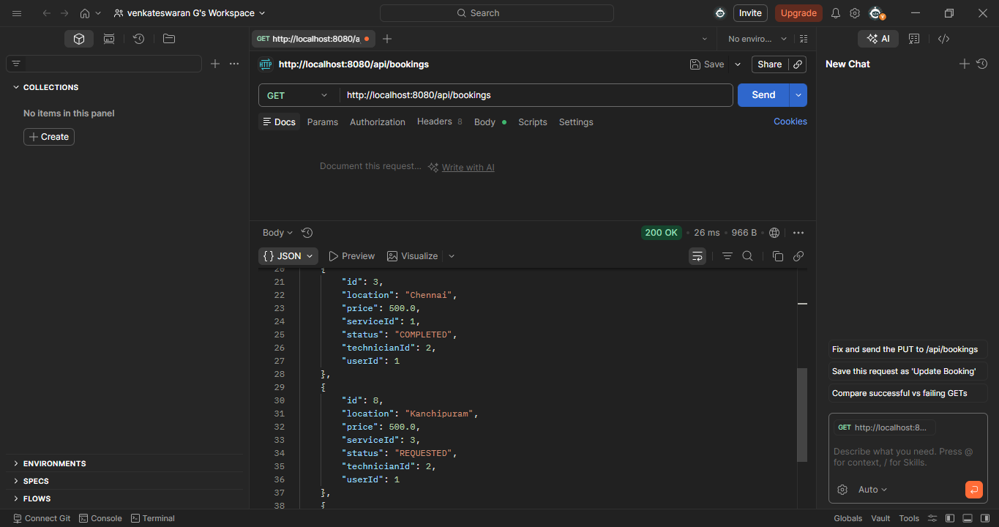
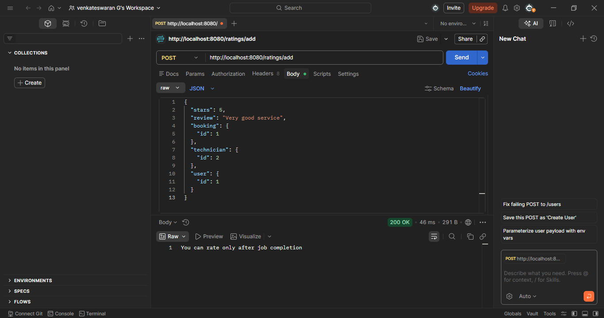
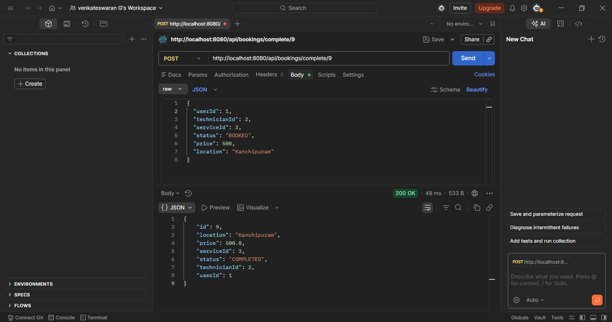

# Service Booking & Appointment System

A full stack web application where users can find technicians and book services.

## Technologies Used

Backend:
- Java Spring Boot
- MySQL
- REST API

## Features

- View available technicians
- Book service appointments
- Technician profile with image
- REST API backend

## API Endpoints

GET /api/technicians  
POST /api/bookings

## Screenshots

## Developer

Venkateswaran G